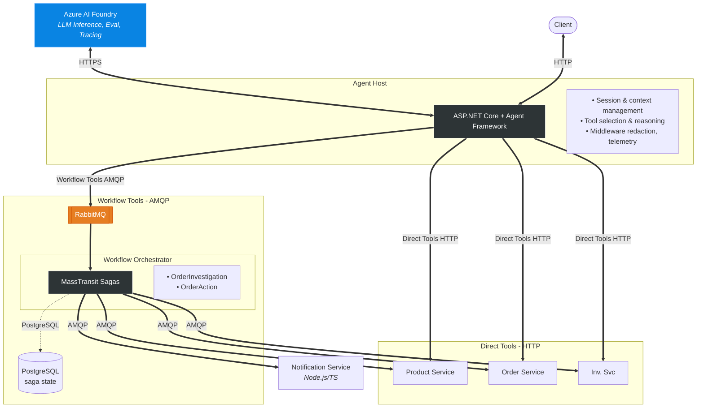

# NexusOps

A domain-agnostic AI agent orchestrator that separates cognition from durable workflow execution. An AI agent handles natural language understanding and tool selection. A message-driven saga orchestrator handles long-running workflows, approval gates, failure recovery, and compensation. The two meet at a clean boundary — the agent publishes commands to a message bus when work needs durability, and queries workflow status when results are needed.

Ships with an **E-Commerce Operations** sample domain. The same orchestration core can be swapped to any domain by replacing the domain services, seed data, and tool definitions.

---

## Architecture



### Two Communication Paths

Every request follows one of two paths, decided by the AI agent:

**Direct Path** — Simple, single-service read queries. Agent Host calls a domain service via HTTP, LLM synthesizes the answer. Fast, synchronous.

**Saga Path** — Complex multi-service investigations or actions with side effects. Agent Host publishes a command to RabbitMQ. A MassTransit saga coordinates the work durably across services, handles partial failure, and gates side effects behind human approval.

---

## Tech Stack

| Component | Technology |
|---|---|
| AI Reasoning | Microsoft Agent Framework |
| Durable Orchestration | MassTransit + RabbitMQ |
| Model Provider & Evaluation | Azure AI Foundry |
| App Orchestration & Observability | Aspire |
| Agent Host | ASP.NET Core |
| Workflow Orchestrator | ASP.NET Core + Entity Framework Core |
| Domain Services (Product, Order, Inventory) | ASP.NET Core Minimal APIs |
| Notification Service | Node.js + Express (TypeScript) + amqplib |
| Saga Persistence | PostgreSQL |
| Message Broker | RabbitMQ |

---

## Sample Domain: E-Commerce Operations

The sample domain simulates the backend systems of an e-commerce platform. A user types natural language queries and the agent handles everything — from simple lookups to multi-service investigations with approval-gated actions.

### Domain Services

**Product Service** — Product catalog: name, description, price, category, rating. Read-only.

**Order Service** — Orders and order items with statuses: placed, confirmed, shipped, delivered, delayed, cancelled, refunded.

**Inventory Service** — Stock levels per product. Supports investigation queries like "why was this order delayed" (stock was zero at time of order).

**Notification Service** — Sends order confirmations, refund confirmations, low-stock alerts. The only service with side effects. Built in Node.js/TypeScript to demonstrate polyglot interop with MassTransit's wire protocol.

### Example Queries

| Query | Path |
|---|---|
| "Show me recent orders for customer Alice" | Direct → Order Service |
| "What's the current stock for wireless headphones?" | Direct → Inventory Service |
| "Why was order #4521 delayed?" | Saga → OrderInvestigationSaga fans out to Order + Inventory + Product services |
| "Refund order #4521 and notify the customer" | Saga → OrderActionSaga with approval gate |

---

## Prerequisites

- [.NET 10 SDK](https://dotnet.microsoft.com/download) (or current supported version)
- [Node.js 20+](https://nodejs.org/)
- [Docker Desktop](https://www.docker.com/products/docker-desktop/)
- Azure AI Foundry credentials (endpoint URL, API key, deployment name)

---

## Getting Started

### 1. Clone the repository

```bash
git clone https://github.com/<your-username>/NexusOps.git
cd NexusOps
```

### 2. Configure Azure AI Foundry credentials

Copy the example environment file and add your credentials:

```bash
cp .env.example .env
```

Edit `.env` with your Azure AI Foundry endpoint, API key, and model deployment name.

### 3. Run the application

```bash
dotnet run --project src/NexusOps.AppHost
```

This starts everything — all application services, RabbitMQ, and PostgreSQL — with service discovery and telemetry wired automatically via Aspire.

### 4. Open the Aspire Dashboard

The Aspire developer dashboard launches automatically and provides distributed tracing, structured logs, metrics, and container monitoring across all services in a single view.

### 5. Send a query

```bash
curl -X POST http://localhost:<port>/api/chat/sessions \
  -H "Content-Type: application/json" \
  -d '{"message": "Show me all delayed orders"}'
```

---

## Key Design Decisions

**LLM for cognition, bus for durability.** The AI agent decides what to do. MassTransit guarantees it gets done. They never cross responsibilities.

**Curated tools over raw Swagger.** The LLM sees high-level tools like `investigate_delayed_order` instead of `GET /orders?status=delayed`. Better tool selection, simpler prompts, safer boundaries.

**Side effects require approval.** Any operation that changes real-world state (refund, notification) goes through the OrderActionSaga with a human approval gate. Read operations auto-execute.

**Saga communication over AMQP.** When sagas dispatch work to domain services, commands flow over RabbitMQ — not HTTP. Full delivery guarantees, retry, and dead-letter handling.

**Domain-pluggable architecture.** The orchestration core (Agent Host, Workflow Orchestrator, Aspire AppHost) is domain-agnostic. The E-Commerce domain is a swappable sample pack. Same architecture works for FinOps, ServiceOps, or SupportOps.

---

## Project Structure

```
src/
├── NexusOps.AppHost/              # Aspire AppHost — declares topology, starts everything
├── NexusOps.ServiceDefaults/      # Shared Aspire defaults (OTEL, health, resilience)
├── NexusOps.AgentHost/            # ASP.NET Core + Agent Framework
├── NexusOps.WorkflowOrchestrator/ # ASP.NET Core + MassTransit sagas
├── NexusOps.ProductService/       # Product catalog API + MassTransit consumer
├── NexusOps.OrderService/         # Order management API + MassTransit consumer
├── NexusOps.InventoryService/     # Inventory/stock API + MassTransit consumer
├── NexusOps.NotificationService/  # Node.js/TypeScript notification service
packages/
├── NexusOps.Contracts/            # Shared message types, DTOs, tool contracts
├── NexusOps.Evaluation/           # Foundry evaluation dataset + runner
├── NexusOps.SeedData/             # Synthetic data generators, scenario profiles
docs/
├── ARCHITECTURE.md                # Architecture details and ADRs
├── demo-scenarios/                # Step-by-step demo walkthroughs
```

---

## Saga Designs

### OrderInvestigationSaga

Coordinates parallel data gathering from multiple services for complex read queries.

```
Requested → Dispatching → WaitingForResults → Aggregating → Completed / PartiallyCompleted / TimedOut
```

Fans out to Order, Inventory, and Product services simultaneously. Returns partial results with degradation notes if a service is unavailable.

### OrderActionSaga

Handles operations with real-world side effects through an approval gate.

```
Requested → AwaitingApproval → Approved → Executing → Completed / Compensating
```

Pauses for human approval before executing. Compensates if execution fails partway through (e.g., refund succeeded but notification failed).

---

## Evaluation

An evaluation dataset with test cases covering simple reads, multi-step investigations, action queries, and degraded scenarios. Uses Azure AI Foundry agent evaluators for tool selection accuracy, task completion, and tool call correctness.

```bash
dotnet run --project packages/NexusOps.Evaluation
```

---

## Roadmap

- [ ] React frontend with AG-UI streaming
- [ ] Integration test suite (saga tests, tool adapter tests)
- [ ] CI/CD pipeline
- [ ] Kafka audit/event stream
- [ ] Redis session cache
- [ ] Kubernetes deployment (Helm manifests)
- [ ] Second domain pack
- [ ] Multiple agent personas

---

## License

[MIT](LICENSE)