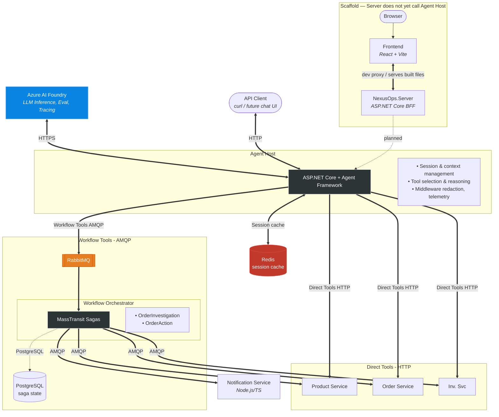

# NexusOps

A domain-agnostic AI agent orchestrator that separates cognition from durable workflow execution. An AI agent handles natural language understanding and tool selection. A message-driven saga orchestrator handles long-running workflows, approval gates, failure recovery, and compensation. The two meet at a clean boundary — the agent publishes commands to a message bus when work needs durability, and queries workflow status when results are needed.

Ships with an **E-Commerce Operations** sample domain. The same orchestration core can be swapped to any domain by replacing the domain services, seed data, and tool definitions.

---

## Why this project

NexusOps is a proof-of-concept that translates patterns from fintech operations engineering into agentic-AI workflow design. Three patterns carry over directly:

- **Multi-source aggregation → investigation fan-out.** Reconciling an incident across trading, settlement, and reference-data systems maps to `OrderInvestigationSaga` fanning out reads across Order, Inventory, and Product services in parallel and returning partial results under degradation.
- **Maker-checker approval → the human approval gate.** Financial operations rarely let one actor both propose and execute a state-changing action. `OrderActionSaga` encodes the same discipline: any mutation (refund, cancel) pauses in an `AwaitingApproval` state until a human approves it — the notification that reports the outcome afterward isn't a second approval step of its own, it inherits that same decision as its consent (see [Key Design Decisions](#key-design-decisions)).
- **Compensation on partial failure → saga compensation.** Reversing a partially-applied write when a downstream leg fails is the same shape whether the leg is a trade settlement or a refund whose confirmation notification never sent.

The AI agent supplies the natural-language front end; the saga orchestrator supplies the durability guarantees an operations team would expect from any system that touches money or inventory. Curated tools stand in for a governed API surface — the agent gets named capabilities, never raw database or endpoint access.

---

## Architecture


```mermaid
graph TD
    %% Define Nodes
    Foundry[Azure AI Foundry<br/><i>LLM Inference, Eval, Tracing</i>]
    Client([API Client<br/><i>curl / future chat UI</i>])
    Redis[(Redis<br/>session cache)]

    subgraph Host [Agent Host]
        AH[ASP.NET Core + Agent Framework]
        AH_D[• Session & context management<br/>• Tool selection & reasoning<br/>• Middleware redaction, telemetry]
    end

    subgraph Direct [Direct Tools - HTTP]
        Prod[Product Service]
        Order[Order Service]
        Inv[Inv. Svc]
    end

    subgraph Async [Workflow Tools - AMQP]
        RMQ[[RabbitMQ]]@{ "type" : "queue" }
        subgraph Orch [Workflow Orchestrator]
            MT[MassTransit Sagas]
            MT_D[• OrderInvestigation<br/>• OrderAction]
        end
        PG[(PostgreSQL<br/>saga state)]
    end

    Notify[Notification Service<br/><i>Node.js/TS</i>]

    subgraph Scaffold [Scaffold — Server does not yet call Agent Host]
        WebUI([Browser])
        FE[Frontend<br/><i>React + Vite</i>]
        Server[NexusOps.Server<br/><i>ASP.NET Core BFF</i>]
    end

    %% Connections
    Foundry <==> |HTTPS| AH
    Client <==> |HTTP| AH
    AH <==> |Session cache| Redis

    AH ==> |Direct Tools HTTP| Prod
    AH ==> |Direct Tools HTTP| Order
    AH ==> |Direct Tools HTTP| Inv

    AH ==> |Workflow Tools AMQP| RMQ
    RMQ ==> MT
    MT -.-> |PostgreSQL| PG
    
    %% Async Back-channel
    MT ==> |AMQP| Prod
    MT ==> |AMQP| Order
    MT ==> |AMQP| Inv
    MT ==> |AMQP| Notify

    %% Scaffold — Server serves the built frontend today (dev proxy + published static files);
    %% it does not yet call Agent Host
    WebUI --> FE
    FE <==> |dev proxy / serves built files| Server
    Server -.-> |planned| AH

    %% Styles
    style AH fill:#2d3436,color:#fff,stroke:#fff
    style Foundry fill:#0984e3,color:#fff,stroke:#74b9ff
    style RMQ fill:#e67e22,color:#fff,stroke:#d35400
    style MT fill:#2d3436,color:#fff,stroke:#fff
    style Redis fill:#c0392b,color:#fff,stroke:#e74c3c
```

### Two Communication Paths

Every request follows one of two paths, decided by the AI agent:

**Direct Path** — Simple, single-service read queries. Agent Host calls a domain service via HTTP, LLM synthesizes the answer. Fast, synchronous.

**Saga Path** — Complex multi-service investigations or actions with side effects. Agent Host publishes a command to RabbitMQ. A MassTransit saga coordinates the work durably across services, handles partial failure, and gates side effects behind human approval.

---

## Tech Stack

| Component | Technology | Status |
|---|---|---|
| AI Reasoning | Microsoft Agent Framework | Implemented |
| Durable Orchestration | MassTransit + RabbitMQ | Implemented |
| Model Provider | Azure AI Foundry | Implemented |
| Evaluation | Dependency-light console runner (`NexusOps.Evaluation`) | Implemented |
| App Orchestration & Observability | Aspire | Implemented |
| Agent Host | ASP.NET Core | Implemented |
| Workflow Orchestrator | ASP.NET Core + Entity Framework Core | Implemented |
| Domain Services (Product, Order, Inventory) | ASP.NET Core Minimal APIs | Implemented |
| Notification Service | Node.js + TypeScript + amqplib (no framework) | Implemented |
| Saga Persistence | PostgreSQL | Implemented |
| Message Broker | RabbitMQ | Implemented |

---

## Sample Domain: E-Commerce Operations

The sample domain simulates the backend systems of an e-commerce platform. A user types natural language queries and the agent handles everything — from simple lookups to multi-service investigations with approval-gated actions.

### Domain Services

**Product Service** — Product catalog: name, description, price, category, weight. Read-only.

**Order Service** — Orders and order items with lifecycle statuses: pending, processing, shipped, delivered, delayed, cancelled, refunded. Anomalous orders additionally carry an anomaly reason — delayed, missing, or payment-failed — which is what `investigate_order_anomaly` filters on.

**Inventory Service** — Stock levels per product. Supports investigation queries like "why was this order delayed" (stock was zero at time of order).

**Notification Service** — Consumes `NotificationRequested`, published on every `OrderActionSaga` terminal outcome that follows a human decision (rejected; executed, failed, or failed-and-compensated after approval — a pre-approval validation failure publishes none), and logs one structured JSON line per outcome. Built in Node.js/TypeScript (no framework, just `amqplib`) to demonstrate polyglot interop with MassTransit's wire protocol.

### Example Queries

| Query | Path |
|---|---|
| "What's the status of order ORD-0001?" | Direct → Order Service |
| "What's the current stock for SKU-ELEC-001?" | Direct → Inventory Service |
| "Why was order ORD-0001 delayed?" | Saga → OrderInvestigationSaga fans out to Order + Inventory + Product services |
| "Refund order ORD-0004" | Saga → OrderActionSaga with approval gate |

---

## Prerequisites

- [.NET 10 SDK](https://dotnet.microsoft.com/download) (or current supported version)
- [Node.js 24+](https://nodejs.org/)
- [Docker Desktop](https://www.docker.com/products/docker-desktop/)
- Azure AI Foundry credentials (endpoint URL, API key, deployment name)

---

## Getting Started

### 1. Clone the repository

```bash
git clone https://github.com/<your-username>/NexusOps.git
cd NexusOps
```

### 2. Configure Azure AI Foundry credentials

**Use user secrets.** `appsettings.Development.json` is tracked by Git, so a key placed there is one
`git commit -a` away from being published. User secrets live outside the repository entirely:

```bash
cd NexusOps.AgentHost
dotnet user-secrets set "AzureAI:ApiKey"         "<your-api-key>"
dotnet user-secrets set "AzureAI:Endpoint"       "<your-endpoint>"
dotnet user-secrets set "AzureAI:DeploymentName" "<your-deployment>"
```

For CI and containers, supply the key as the `AZURE_AI_FOUNDRY_API_KEY` environment variable
instead; the endpoint and deployment name are read from configuration as usual.

The non-secret values may also be set in `appsettings.Development.json`, which ships with
placeholders showing the shape:

```json
{
  "AzureAI": {
    "Endpoint": "<your-endpoint>",
    "DeploymentName": "<your-deployment>"
  }
}
```

Do not add `ApiKey` to that file.

### 3. Run the application

```bash
dotnet run --project NexusOps.AppHost
```

This starts all services, Redis, RabbitMQ, and PostgreSQL with service discovery and telemetry wired automatically via Aspire.

### 4. Open the Aspire Dashboard

The Aspire developer dashboard launches automatically and provides distributed tracing, structured logs, metrics, and container monitoring across all services in a single view.

### 5. Send a query

```bash
# New session — server mints a sessionId
curl -X POST http://localhost:<port>/api/chat \
  -H "Content-Type: application/json" \
  -d '{"prompt": "Show me all delayed orders"}'
# Response: { "response": "...", "sessionId": "<guid>", "toolsInvoked": ["investigate_order_anomaly"] }

# Continue the conversation
curl -X POST http://localhost:<port>/api/chat \
  -H "Content-Type: application/json" \
  -d '{"prompt": "What is the status of the second one?", "sessionId": "<guid>"}'
```

---

## Key Design Decisions

**LLM for cognition, bus for durability.** The AI agent decides what to do. MassTransit guarantees it gets done. They never cross responsibilities.

**Curated tools over raw Swagger.** The LLM sees high-level tools like `investigate_order_anomaly` instead of `GET /orders?status=delayed`. Better tool selection, simpler prompts, safer boundaries.

**Side effects require approval.** Any operation that changes real-world state (refund, cancellation) goes through the OrderActionSaga with a human approval gate. Read operations auto-execute. (The saga's terminal-outcome notification carries that same approve/reject decision as its consent, not a separate gate of its own — verified against `OrderActionSaga.cs` in `specs/010-constitution-reconciliation/`; the one terminal outcome with no prior human decision, a pre-approval validation failure, publishes no notification at all.)

**Saga communication over AMQP.** When sagas dispatch work to domain services, commands flow over RabbitMQ — not HTTP. Full delivery guarantees, retry, and dead-letter handling.

**Domain-pluggable architecture.** The orchestration core (Agent Host, Workflow Orchestrator, Aspire AppHost) is domain-agnostic. The E-Commerce domain is a swappable sample pack. Same architecture works for FinOps, ServiceOps, or SupportOps.

---

## Project Structure

```
NexusOps.AppHost/          # Aspire AppHost — topology, service discovery, env wiring
NexusOps.ServiceDefaults/  # Shared class library — OTEL, health checks, resilience (referenced by all services)
NexusOps.AgentHost/        # ASP.NET Core + Agent Framework — LLM reasoning, tool dispatch, session management
NexusOps.Contracts/        # Shared library — ToolResult<T>, ToolNames, SeedDataConstants, response DTOs
NexusOps.OrderService/     # ASP.NET Core Minimal API — order read operations, in-memory seed data
NexusOps.InventoryService/ # ASP.NET Core Minimal API — inventory read operations, in-memory seed data
NexusOps.ProductService/   # ASP.NET Core Minimal API — product read operations, in-memory seed data
NexusOps.WorkflowOrchestrator/ # MassTransit v8 + RabbitMQ saga host — OrderInvestigationSaga, OrderActionSaga, PostgreSQL/EF Core state
NexusOps.Evaluation/       # Dependency-light console project — evaluates AgentHost's tool-routing accuracy against a checked-in dataset
NexusOps.Server/           # ASP.NET Core — serves React frontend, placeholder API (scaffold only)
NexusOps.Tests/            # xUnit — unit tests across anomalies, sessions, tool cancellation, both sagas, and the evaluation runner
NexusOps.IntegrationTests/ # xUnit + Aspire.Hosting.Testing — both sagas end-to-end over the real message bus
notification-service/      # Node.js + TypeScript + amqplib — logs a simulated email per OrderActionSaga terminal outcome
frontend/                  # React 19 + Vite + TypeScript — chat UI (scaffold only)
.specify/                  # Spec-kit configuration, templates, memory, extensions
specs/                     # Feature specifications, plans, and task lists
```

> **Planned but not yet implemented:** full React chat UI (currently a scaffold).

---

## Saga Designs

### OrderInvestigationSaga

**Status:** Implemented (feature 005).

Coordinates parallel data gathering from multiple services for complex read queries. Three states:

```
Investigating → Completed | Failed
```

Fans out to Order, Inventory, and Product services simultaneously, each bounded by its own timeout, then finalizes into one of the two terminal states based on the investigation's `InvestigationCompleteness` (`Complete` / `Degraded` / `Failed`) — **not** a third state. A `Degraded` completeness (one source unavailable or timed out, findable by name in the result) still finalizes in `Completed`, because partial results are treated as a success; the saga only transitions to `Failed` when the order itself can't be identified.

### OrderActionSaga

**Status:** Implemented (feature 006).

Handles operations with real-world side effects (refund, cancellation) through a mandatory human approval gate. Six states:

```
Validating → AwaitingApproval → Executing → Completed | Rejected | Failed
```

Parks in `AwaitingApproval` until a human calls `POST /api/approvals/{id}/approve` or `/reject` — a reject transitions straight to the terminal `Rejected` state, no mutation ever happens before that. On approval, `Executing` runs synchronously behind the request; it finalizes in `Completed` or `Failed` depending on the reported `OrderActionExecutionOutcome` (`Executed` / `Failed` / `FailedAndCompensated`) — that outcome, not a saga state, is what a caller actually sees. A confirmed failure partway through (e.g., cancellation's inventory leg faults after the order leg already succeeded) is compensated via a reverting call, reported as `FailedAndCompensated`; an unconfirmed timeout is left uncompensated and reported honestly as `Failed` rather than risking a worse silent inconsistency. A notification is published on every terminal outcome that follows a human decision (`Rejected`, `Completed`, `Failed`-via-execution); the one path with no prior decision — a pre-approval validation failure landing in `Failed` — publishes none.

---

## Testing

```bash
dotnet test NexusOps.deployable.slnf          # unit tests
cd frontend && npm run lint && npm run typecheck
cd notification-service && npm run typecheck
```

`NexusOps.Tests` covers anomaly classification and severity, order seed integrity, session
resolution across store outages, turn trimming, startup configuration validation, cancellation
propagation through the tool handlers, both sagas' full lifecycle (approve/reject/execute/compensate,
concurrent-decision safety), and `NexusOps.Evaluation`'s dataset validation and tool-invocation
extraction. It is unit-level by design — a fake `IDistributedCache`, a pinned `TimeProvider`, and
MassTransit's in-memory test harness, with no Redis, RabbitMQ, Postgres, or Azure AI dependency — so
it runs on fork pull requests without secrets.

`NexusOps.IntegrationTests` exercises both sagas end-to-end over a real, Docker-provisioned RabbitMQ
and PostgreSQL via `Aspire.Hosting.Testing` — never through AgentHost's HTTP/LLM layer, so it needs no
Azure AI credentials, but it does need Docker running locally:

```bash
dotnet test NexusOps.IntegrationTests/NexusOps.IntegrationTests.csproj
```

`ci.yml` runs four jobs: `dotnet` (build, unit test, validate the evaluation dataset, and
compile-only build `NexusOps.IntegrationTests`) and `frontend`/`notification-service` (lint/typecheck)
on every push and pull request to `master`; a fourth job, `integration-tests`, actually runs the
Docker-dependent integration suite above but only on `push` to `master`, never on a pull request, so a
slow image pull or container flake can't fail or block a PR.

---

## Evaluation

`NexusOps.Evaluation` is a dependency-light console project (no eval framework — just
`System.Text.Json` and `HttpClient`) that checks the agent's tool-routing accuracy against a curated
JSON dataset of 24 realistic prompts (`NexusOps.Evaluation/Data/eval-cases.json`), each labeled with
the tool it expects the agent to invoke and that tool's path (Direct or Saga). Every one of the
project's 9 curated tools is covered by at least two differently-phrased cases, and both paths are
represented, including the two approval-gated mutating tools — which, per the approval-gated design
itself, never execute anything just from being exercised here; they only ever reach
`AwaitingApproval`.

**Dataset validation** — credential-free, offline, no running services of any kind:

```bash
dotnet run --project NexusOps.Evaluation -- --validate-only
```

Checks the dataset's schema, that every case ID is unique, that every `expectedTool` names a tool
this project actually curates, and that every `expectedPath` is valid and consistent with its tool.
This is the command CI runs on every push and pull request — it requires no network access and no
Azure AI credentials, so it can never be broken by their absence.

**Live evaluation** — requires a running `NexusOps.AgentHost` with valid Azure AI credentials
configured (see [Configure Azure AI Foundry credentials](#2-configure-azure-ai-foundry-credentials)):

```bash
dotnet run --project NexusOps.AppHost    # or: dotnet run --project NexusOps.AgentHost

dotnet run --project NexusOps.Evaluation -- --base-url <agent-host-url>
# default base URL is http://localhost:5186 (AgentHost's own direct-run profile);
# pass --base-url (or set AGENTHOST_BASE_URL) when running via Aspire, whose port is dynamic —
# check the Aspire dashboard for agent-host's external endpoint.
```

This is the default mode (no flag needed) — it sends every dataset prompt to a fresh, session-less
turn, records which tool the agent actually invoked, and prints a pass/fail line per case plus a
summary table (total/passed/failed/pass rate). Before sending any prompt, it probes `AgentHost`'s
`/health` endpoint; if nothing is reachable there, it prints a `SKIPPED` banner with the exact setup
steps above and exits successfully — **never** as a failure. This is what makes it safe for live mode
to be the default: running it by accident with no `AgentHost` running cannot break anything.

For the credential-free checks that run in CI today, see [Testing](#testing).

---

## Roadmap

**Implemented:**
- [x] Redis-backed session management (multi-turn conversation continuity, 30-min TTL, 20-turn cap, graceful degradation)
- [x] CI/CD pipeline (build, CodeQL, dependency review, Dependabot)
- [x] Unit test suite (`NexusOps.Tests`, runs in CI)
- [x] Evaluation dataset + runner (`NexusOps.Evaluation`, credential-free `--validate-only` runs in CI)
- [x] Workflow Orchestrator (MassTransit sagas, PostgreSQL state)
- [x] Notification Service (Node.js/TypeScript)
- [x] Integration test suite (`NexusOps.IntegrationTests`, Aspire.Hosting.Testing over real Docker-provisioned RabbitMQ/PostgreSQL, gated to `push` to `master`)

**Planned:**
- [ ] React chat UI with AG-UI streaming
- [ ] Kubernetes deployment (Helm manifests)
- [ ] Kafka audit/event stream
- [ ] Second domain pack
- [ ] Multiple agent personas

---

## License

[MIT](LICENSE)