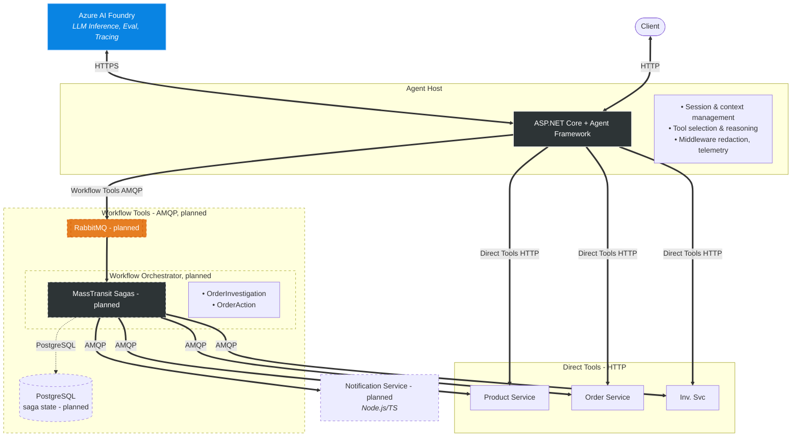

# NexusOps

A domain-agnostic AI agent orchestrator that separates cognition from durable workflow execution. An AI agent handles natural language understanding and tool selection. A message-driven saga orchestrator handles long-running workflows, approval gates, failure recovery, and compensation. The two meet at a clean boundary — the agent publishes commands to a message bus when work needs durability, and queries workflow status when results are needed.

Ships with an **E-Commerce Operations** sample domain. The same orchestration core can be swapped to any domain by replacing the domain services, seed data, and tool definitions.

---

## Why this project

NexusOps is a proof-of-concept that translates patterns from fintech operations engineering into agentic-AI workflow design. Three patterns carry over directly:

- **Multi-source aggregation → investigation fan-out.** Reconciling an incident across trading, settlement, and reference-data systems maps to `OrderInvestigationSaga` fanning out reads across Order, Inventory, and Product services in parallel and returning partial results under degradation.
- **Maker-checker approval → the human approval gate.** Financial operations rarely let one actor both propose and execute a state-changing action. `OrderActionSaga` encodes the same discipline: any mutation (refund, cancel, notify) pauses in an `AwaitingApproval` state until a human approves it.
- **Compensation on partial failure → saga compensation.** Reversing a partially-applied write when a downstream leg fails is the same shape whether the leg is a trade settlement or a refund whose confirmation notification never sent.

The AI agent supplies the natural-language front end; the saga orchestrator supplies the durability guarantees an operations team would expect from any system that touches money or inventory. Curated tools stand in for a governed API surface — the agent gets named capabilities, never raw database or endpoint access.

---

## Architecture


```mermaid
graph TD
    %% Define Nodes
    Foundry[Azure AI Foundry<br/><i>LLM Inference, Eval, Tracing</i>]
    Client([Client])
    
    subgraph Host [Agent Host]
        AH[ASP.NET Core + Agent Framework]
        AH_D[• Session & context management<br/>• Tool selection & reasoning<br/>• Middleware redaction, telemetry]
    end

    subgraph Direct [Direct Tools - HTTP]
        Prod[Product Service]
        Order[Order Service]
        Inv[Inv. Svc]
    end

    subgraph Async [Workflow Tools - AMQP, planned]
        RMQ[[RabbitMQ - planned]]@{ "type" : "queue" }
        subgraph Orch [Workflow Orchestrator, planned]
            MT[MassTransit Sagas - planned]
            MT_D[• OrderInvestigation<br/>• OrderAction]
        end
        PG[(PostgreSQL<br/>saga state - planned)]
    end

    Notify[Notification Service - planned<br/><i>Node.js/TS</i>]

    %% Connections
    Foundry <==> |HTTPS| AH
    Client <==> |HTTP| AH

    AH ==> |Direct Tools HTTP| Prod
    AH ==> |Direct Tools HTTP| Order
    AH ==> |Direct Tools HTTP| Inv

    AH ==> |Workflow Tools AMQP| RMQ
    RMQ ==> MT
    MT -.-> |PostgreSQL| PG
    
    %% Async Back-channel
    MT ==> |AMQP| Prod
    MT ==> |AMQP| Order
    MT ==> |AMQP| Inv
    MT ==> |AMQP| Notify

    %% Styles
    style AH fill:#2d3436,color:#fff,stroke:#fff
    style Foundry fill:#0984e3,color:#fff,stroke:#74b9ff
    style RMQ fill:#e67e22,color:#fff,stroke:#d35400,stroke-dasharray: 5 5
    style MT fill:#2d3436,color:#fff,stroke:#fff,stroke-dasharray: 5 5
    style PG stroke-dasharray: 5 5
    style Notify stroke-dasharray: 5 5
    style Orch stroke-dasharray: 5 5
    style Async stroke-dasharray: 5 5
```

### Two Communication Paths

Every request follows one of two paths, decided by the AI agent:

**Direct Path** — Simple, single-service read queries. Agent Host calls a domain service via HTTP, LLM synthesizes the answer. Fast, synchronous.

**Saga Path** — Complex multi-service investigations or actions with side effects. Agent Host publishes a command to RabbitMQ. A MassTransit saga coordinates the work durably across services, handles partial failure, and gates side effects behind human approval.

---

## Tech Stack

| Component | Technology | Status |
|---|---|---|
| AI Reasoning | Microsoft Agent Framework | Implemented |
| Durable Orchestration | MassTransit + RabbitMQ | Planned |
| Model Provider | Azure AI Foundry | Implemented |
| Evaluation | Azure AI Foundry evaluators | Planned |
| App Orchestration & Observability | Aspire | Implemented |
| Agent Host | ASP.NET Core | Implemented |
| Workflow Orchestrator | ASP.NET Core + Entity Framework Core | Planned |
| Domain Services (Product, Order, Inventory) | ASP.NET Core Minimal APIs | Implemented |
| Notification Service | Node.js + Express (TypeScript) + amqplib | Planned |
| Saga Persistence | PostgreSQL | Planned |
| Message Broker | RabbitMQ | Planned |

---

## Sample Domain: E-Commerce Operations

The sample domain simulates the backend systems of an e-commerce platform. A user types natural language queries and the agent handles everything — from simple lookups to multi-service investigations with approval-gated actions.

### Domain Services

**Product Service** — Product catalog: name, description, price, category, rating. Read-only.

**Order Service** — Orders and order items with lifecycle statuses: pending, processing, shipped, delivered, delayed, cancelled. Anomalous orders additionally carry an anomaly reason — delayed, missing, or payment-failed — which is what `investigate_order_anomaly` filters on.

**Inventory Service** — Stock levels per product. Supports investigation queries like "why was this order delayed" (stock was zero at time of order).

**Notification Service** — Sends order confirmations, refund confirmations, low-stock alerts. The only service with side effects. Built in Node.js/TypeScript to demonstrate polyglot interop with MassTransit's wire protocol.

### Example Queries

| Query | Path |
|---|---|
| "Show me recent orders for customer Alice" | Direct → Order Service |
| "What's the current stock for wireless headphones?" | Direct → Inventory Service |
| "Why was order #4521 delayed?" | Saga → OrderInvestigationSaga fans out to Order + Inventory + Product services |
| "Refund order #4521 and notify the customer" | Saga → OrderActionSaga with approval gate |

---

## Prerequisites

- [.NET 10 SDK](https://dotnet.microsoft.com/download) (or current supported version)
- [Node.js 24+](https://nodejs.org/)
- [Docker Desktop](https://www.docker.com/products/docker-desktop/)
- Azure AI Foundry credentials (endpoint URL, API key, deployment name)

---

## Getting Started

### 1. Clone the repository

```bash
git clone https://github.com/<your-username>/NexusOps.git
cd NexusOps
```

### 2. Configure Azure AI Foundry credentials

**Use user secrets.** `appsettings.Development.json` is tracked by Git, so a key placed there is one
`git commit -a` away from being published. User secrets live outside the repository entirely:

```bash
cd NexusOps.AgentHost
dotnet user-secrets set "AzureAI:ApiKey"         "<your-api-key>"
dotnet user-secrets set "AzureAI:Endpoint"       "<your-endpoint>"
dotnet user-secrets set "AzureAI:DeploymentName" "<your-deployment>"
```

For CI and containers, supply the key as the `AZURE_AI_FOUNDRY_API_KEY` environment variable
instead; the endpoint and deployment name are read from configuration as usual.

The non-secret values may also be set in `appsettings.Development.json`, which ships with
placeholders showing the shape:

```json
{
  "AzureAI": {
    "Endpoint": "<your-endpoint>",
    "DeploymentName": "<your-deployment>"
  }
}
```

Do not add `ApiKey` to that file.

### 3. Run the application

```bash
dotnet run --project NexusOps.AppHost
```

This starts all implemented services and Redis with service discovery and telemetry wired automatically via Aspire.

### 4. Open the Aspire Dashboard

The Aspire developer dashboard launches automatically and provides distributed tracing, structured logs, metrics, and container monitoring across all services in a single view.

### 5. Send a query

```bash
# New session — server mints a sessionId
curl -X POST http://localhost:<port>/api/chat \
  -H "Content-Type: application/json" \
  -d '{"prompt": "Show me all delayed orders"}'
# Response: { "response": "...", "sessionId": "<guid>" }

# Continue the conversation
curl -X POST http://localhost:<port>/api/chat \
  -H "Content-Type: application/json" \
  -d '{"prompt": "What is the status of the second one?", "sessionId": "<guid>"}'
```

---

## Key Design Decisions

**LLM for cognition, bus for durability.** The AI agent decides what to do. MassTransit guarantees it gets done. They never cross responsibilities.

**Curated tools over raw Swagger.** The LLM sees high-level tools like `investigate_order_anomaly` instead of `GET /orders?status=delayed`. Better tool selection, simpler prompts, safer boundaries.

**Side effects require approval.** Any operation that changes real-world state (refund, notification) goes through the OrderActionSaga with a human approval gate. Read operations auto-execute.

**Saga communication over AMQP.** When sagas dispatch work to domain services, commands flow over RabbitMQ — not HTTP. Full delivery guarantees, retry, and dead-letter handling.

**Domain-pluggable architecture.** The orchestration core (Agent Host, Workflow Orchestrator, Aspire AppHost) is domain-agnostic. The E-Commerce domain is a swappable sample pack. Same architecture works for FinOps, ServiceOps, or SupportOps.

---

## Project Structure

```
NexusOps.AppHost/          # Aspire AppHost — topology, service discovery, env wiring
NexusOps.ServiceDefaults/  # Shared class library — OTEL, health checks, resilience (referenced by all services)
NexusOps.AgentHost/        # ASP.NET Core + Agent Framework — LLM reasoning, tool dispatch, session management
NexusOps.Contracts/        # Shared library — ToolResult<T>, ToolNames, SeedDataConstants, response DTOs
NexusOps.OrderService/     # ASP.NET Core Minimal API — order read operations, in-memory seed data
NexusOps.InventoryService/ # ASP.NET Core Minimal API — inventory read operations, in-memory seed data
NexusOps.ProductService/   # ASP.NET Core Minimal API — product read operations, in-memory seed data
NexusOps.Server/           # ASP.NET Core — serves React frontend, placeholder API (scaffold only)
NexusOps.Tests/            # xUnit — unit tests for anomaly classification, session handling, tool cancellation
frontend/                  # React 19 + Vite + TypeScript — chat UI (scaffold only)
.specify/                  # Spec-kit configuration, templates, memory, extensions
specs/                     # Feature specifications, plans, and task lists
```

> **Planned but not yet implemented:** `NexusOps.WorkflowOrchestrator` (MassTransit sagas), Notification Service (Node.js/TS), evaluation runner, full React chat UI.

---

## Saga Designs

### OrderInvestigationSaga

**Status:** Planned design — not yet implemented.

Coordinates parallel data gathering from multiple services for complex read queries.

```
Requested → Dispatching → WaitingForResults → Aggregating → Completed / PartiallyCompleted / TimedOut
```

Fans out to Order, Inventory, and Product services simultaneously. Returns partial results with degradation notes if a service is unavailable.

### OrderActionSaga

**Status:** Planned design — not yet implemented.

Handles operations with real-world side effects through an approval gate.

```
Requested → AwaitingApproval → Approved → Executing → Completed / Compensating
```

Pauses for human approval before executing. Compensates if execution fails partway through (e.g., refund succeeded but notification failed).

---

## Testing

```bash
dotnet test NexusOps.deployable.slnf          # unit tests
cd frontend && npm run lint && npm run typecheck
```

`NexusOps.Tests` covers anomaly classification and severity, order seed integrity, session
resolution across store outages, turn trimming, startup configuration validation, and cancellation
propagation through the tool handlers. It is unit-level by design — a fake `IDistributedCache` and a
pinned `TimeProvider`, with no Redis or Azure AI dependency — so it runs on fork pull requests
without secrets.

Both commands run in CI on every push and pull request to `master`.

---

## Evaluation

> **Planned — not yet implemented.** No evaluation project exists in the repository today.

The intended design is an evaluation dataset with test cases covering simple reads, multi-step
investigations, action queries, and degraded scenarios, scored by Azure AI Foundry agent evaluators
for tool selection accuracy, task completion, and tool call correctness.

For the automated checks that **do** run today, see [Testing](#testing).

---

## Roadmap

**Implemented:**
- [x] Redis-backed session management (multi-turn conversation continuity, 30-min TTL, 20-turn cap, graceful degradation)
- [x] CI/CD pipeline (build, CodeQL, dependency review, Dependabot)
- [x] Unit test suite (`NexusOps.Tests`, runs in CI)

**Planned:**
- [ ] Workflow Orchestrator (MassTransit sagas, PostgreSQL state)
- [ ] Notification Service (Node.js/TypeScript)
- [ ] React chat UI with AG-UI streaming
- [ ] Integration test suite
- [ ] Evaluation dataset + runner
- [ ] Kubernetes deployment (Helm manifests)
- [ ] Kafka audit/event stream
- [ ] Second domain pack
- [ ] Multiple agent personas

---

## License

[MIT](LICENSE)